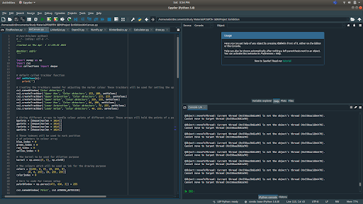
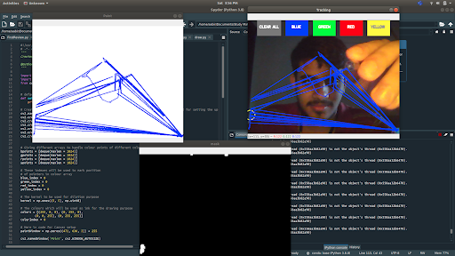

# Air Canvas

>*An attempt is made to use **OpenCV** to build a **hands-free digital canvas** to recognize and understand gestures and to display on the screen.*

**Air Canvas** is a hands-free digital drawing canvas that utilizes a Raspberry Pi, a good quality HD Camera, and OpenCV to recognize and map hand gestures onto a screen. The user’s “brush” can be modified in size and color by using built-in buttons. The direction of the brush is controlled completely using open source OpenCV software and modified to map the pointer finger onto the screen using Pygame following a calibration screen to measure and record the color of the user’s hand. The idea for Air Canvas was a result of our interest in digital drawing and smart photo recognition software.

---

## Objective of the work

The motto of our Air Canvas project resides in the influence of using a simplified form of **model-based method**, for favouring further modifications far more easily. We proposed this air canvas algorithm supported by **landmark alignment** under **replacement framework**. Further beneficial aspects include virtual drawing, writing notes, meeting explanations and further future enhancements as included.

---

## Technologies Used

The *Air Canvas* is built on the following technologies:
- [Python] - Interpreted high-level general-purpose programming language for programming and development
- [OpenCV] - Open Source library of python with programming functions mainly aimed at real-time computer vision
- [NumPy] - Library of Python, adding support for large, multi-dimensional arrays and matrices, along with a large collection of high-level mathematical functions to operate on these arrays

---

## Algorithmic Approach
-   Step 1: Start reading the frames and convert the captured frames to HSV color space (Easy for color detection).
-   Step 2: Prepare the canvas frame and put the respective ink buttons on it.
-   Step 3: Adjust the track bar values for finding the mask of the colored marker.
-   Step 4: Preprocess the mask with morphological operations (Eroding and dilation).
-   Step 5: Detect the contours, find the center coordinates of the largest contour and keep storing them in the array for successive frames (Arrays for drawing points on canvas).
-   Step 6: Finally draw the points stored in an array on the frames and canvas.
---

## Installation
The primary requirement includes the presence of python 3 in the systems along with a helpful and convenient Code Editor as per the user (Spyder recommended)
Check the python version in your computer systems by running the following command in your shell
```sh
python --version
```
Install opencv for your system, if already available it confims its presence
```sh
pip3 install opencv-python
```
---
## Working Code


## Functioning Canvas with Output


---
@author: [aabir13]

[Python]:<https://www.python.org/>
[OpenCV]:<https://opencv.org/>
[NumPy]:<https://numpy.org/>
[aabir13]:<https://github.com/aabir13>
